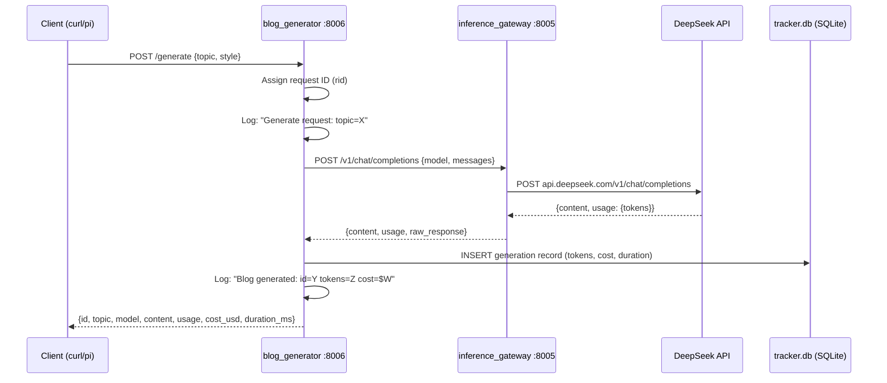
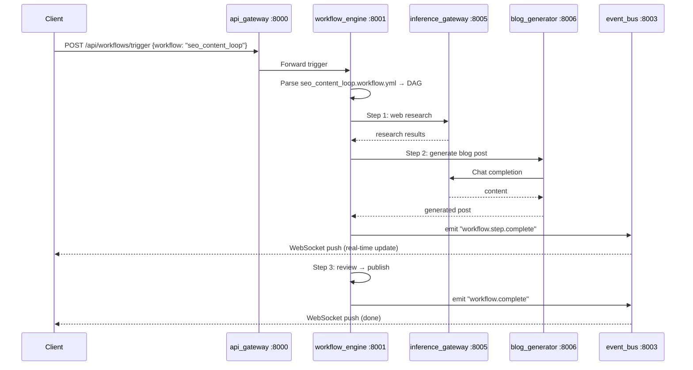

# Data Flow — Blog Generation (Working)



## Target Data Flow — Full Workflow (Phase 2+)



## Provider Resolution Flow

```mermaid
flowchart TD
    A[POST /v1/chat/completions] --> B{model starts with<br>'virtual/'?}
    B -->|yes| C[Cascade through<br>fallback chain]
    B -->|no| D{x-provider header set?}
    D -->|yes| E[Route to specified provider]
    D -->|no| F[Look up model in catalog]
    F --> G{Found?}
    G -->|yes| H[Route to owning provider]
    G -->|no| I[Route to first available provider]
    
    C --> J{Provider 1 available?}
    J -->|yes| K[Try provider 1]
    J -->|no| L{Provider 2 available?}
    K --> M{Success?}
    M -->|yes| N[Return response]
    M -->|no (429/5xx)| L
    L -->|yes| O[Try provider 2]
    L -->|no| P[Return 429 - all exhausted]
    O --> Q{Success?}
    Q -->|yes| N
    Q -->|no| P
```
